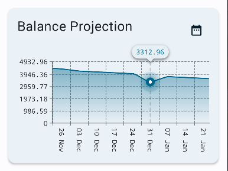
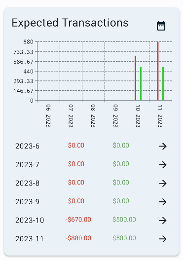
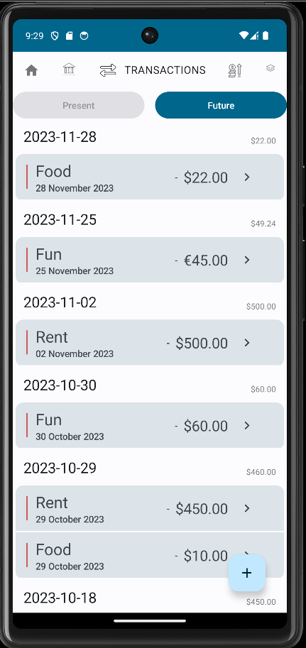
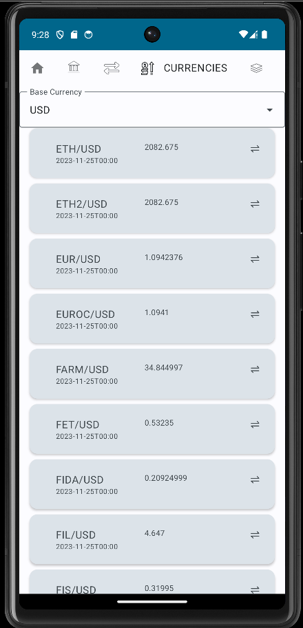

# BudgetApp

## Overview
BudgetApp is a budget management application written in Kotlin that follows the Model-View-Architecture (MVA) design pattern. This application is designed to help users efficiently manage their finances by registering transactions, categorizing them, specifying the currency, and tracking their accounts. Additionally, BudgetApp allows users to register expected transactions in the future, providing insights into the projected balance over time and helping users assess their financial viability.

  

The key features of BudgetApp include:
- **Transaction Management**: Easily record your income and expenses by specifying the amount, category, currency, and account for each transaction.
- **Category Tracking**: Categorize transactions to get a better understanding of your spending patterns and financial habits.
- **Multi-Currency Support**: BudgetApp automatically fetches currency exchange rates from the CurrencyFreaks API and updates them daily, ensuring accurate currency conversion for your transactions.
- **Account Management**: Manage multiple financial accounts, such as checking accounts, savings accounts, and credit cards.
- **Future Transaction Planning**: Register expected future transactions to analyze how your overall balance will evolve over time. Detect potential issues of insufficient funds before they become a problem.

## How does it look?

The app supports balance projection with a neat interface that displays the balance over time
along with the expected transactions.

  
  

It is possible to see organizedly the past transactions and to add new ones.

  

The app supports also automatic fetching of currencies and their exchange rates. And it allows
the user to select their preferred currency.

  

## Installation
1. Clone or download the BudgetApp repository from [GitHub](https://github.com/afcarzero1/Budget).
2. Open the project in your preferred Kotlin development environment (e.g., Android Studio).
3. Build and run the application on your Android device or emulator.

## Getting Started
1. Upon launching BudgetApp, you will be presented with the home screen, which displays an overview of your current financial status.

2. To add a new transaction:
    - Open the transactions screen.
    - Click the "+" button in the bottom right corner.
    - Specify the transaction details, including amount, category, currency, and account.
    - Click "Save" to record the transaction.

3. To manage your categories and accounts:
    - Navigate to the "Categories" and "Accounts" sections in the app.
    - Add, edit, or delete categories and accounts as needed to customize your financial tracking.

5. Currency Exchange Rates:
    - BudgetApp automatically updates currency exchange rates once per day using the CurrencyFreaks API, ensuring accurate currency conversions for your transactions.

## Tech Stack
BudgetApp is built using the following technologies and libraries:
- Kotlin
- Android SDK
- Model-View-Architecture (MVA) design pattern
- CurrencyFreaks API for currency exchange rates

## Contributions
We welcome contributions to BudgetApp. If you have ideas for improvements, bug fixes, or new features, please create a pull request on our GitHub repository.

## License
BudgetApp is open-source software licensed under the [MIT License](LICENSE.md).

The switch icon is taken from [here](https://www.veryicon.com/icons/miscellaneous/fs-icon/switch-38.html)
The categories icon is taken from [here](https://freeicons.io/line-icons-2/category-icon-30673)
Currencies icon : Icon by <a class="link_pro" href="https://freeicons.io/currencies/euro-currencies-icon-700439">Ahmad Smadi</a>
on <a href="https://freeicons.io">freeicons.io</a>

Transactions : Icon by <a class="link_pro" href="https://freeicons.io/basic-ui-6/transaction-icon-709350">Next Gen</a>
on <a href="https://freeicons.io">freeicons.io</a>

Budget icon  <a href="https://iconscout.com/icons/budget" target="_blank">Free Budget  Icon</a> by <a href="https://iconscout.com/contributors/kerismaker">Kerismaker Studio</a> on <a href="https://iconscout.com">IconScout</a>